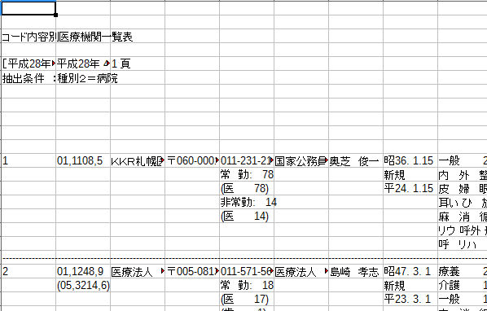

# Groovyを使用して施設情報をいじった話

2016/04/22 yamap_55

---

以下でスライドを公開しています。
https://slideck.io/github.com/yamap55/Slide/20160422/site_groovy.md

---

## Groovyとは

>Groovyは、Java VM(*1)上で動作する動的なスクリプト言語です。 他のスクリプト言語と比較すると、Javaとの親和性が高いことが大きな特長です。たとえば、Groovyの構文はJavaと上位互換であり、Javaでの開発経験やスキルをそのまま生かすことができます。GroovyはJavaの欠点を補い、併用することで最大の効果を発揮する言語です。
>https://www.ntts.co.jp/products/grails/feature.html

Groovy の処理系はオープンソースソフトウェアであり、2015年4月よりApacheソフトウェア財団が管理しています。

---

## Groovyの7つの導入パターン
1. 万能接着剤 (Super Glue)
2. やわらかな心臓 (Liguied Hert)
3. 内視鏡手術 (Keyhole Surgery)
4. スマート設定 (Smart Configuration)
5. 無制限の解放 (Unlimited Openness)
6. 小人さんスクリプト (House-Elf Scripts)
7. プロトタイプ (Prototype)

---

Javaを置き換えるのは狙っていない？

個人的には、スクリプト言語に習熟していないJavaエンジニアが覚えるには最適な言語。

---

## 今回行った手順
1. 厚生局作成の施設情報パース。
2. 独自ID付与。
3. 社内で持っている施設情報に独自ID付与。
4. 厚生局情報と社内情報をマージ。
5. SFインポート形式に変換。

---

## 1. 厚生局作成の施設情報パース。
- [厚生局データ](https://kouseikyoku.mhlw.go.jp/hokkaido/gyomu/gyomu/hoken_kikan/code_ichiran.html)

---
## まとめ
- 国がまとめたデータなんてろくなものじゃない。
- ロジカルチェックは重要。
- Script言語は便利。

---
ご清聴ありがとうございました。