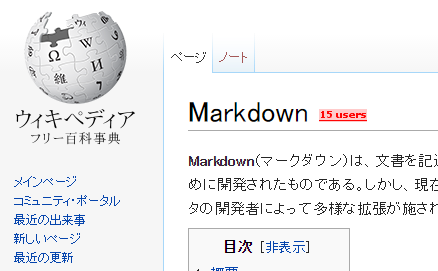

# Markdownのすゝめ
社内勉強会 #14 （2016/11/04）

yamap_55

---

## スライドとか
- スライドは[ここ](https://slideck.io/github.com/yamap55/Slide/20161104/markdown.md)で公開しています。
  - タイトルが大文字に強制変換。。。
- 間違えやツッコミがありましたら口頭、[Twitter](https://twitter.com/yamap_55)、[pull request](https://github.com/yamap55/Slide/edit/master/20161104/markdown.md)などお気軽にどうぞ。

---

## Markdownとは
- 文書を記述するための軽量マークアップ言語
- 本来はプレーンテキストからHTMLを生成するために開発
- 現在はHTML、スライド、LaTeX、シーケンス図、フローチャットなどへ変換する事も可能。
- 多様な拡張が施されるため、各種の方言が存在する。

[wikipedia](https://ja.wikipedia.org/wiki/Markdown)より

---

## Markdownとは
**軽量マークアップ言語なので、html全てを表現できる訳ではありません**

---

## このスライドもMarkdownで書かれています。

---

## 具体的な使い所
- GitHub, Slack, Qiita, Stack Overflow, 各種blogなど
- 社内で使用しているツールではRedmine, GitLab, Jenkinsなどで使用可能。

---

## Markdownの良い所
- 手軽に文章構造を明示できること
- 簡単で、覚えやすいこと
- 読み書きに特別なアプリを必要としないこと
- それでいて、対応アプリを使えば快適に読み書きできること

[参考](http://www.markdown.jp/what-is-markdown/)

---

## 具体例

ここに記載する例は一般的なMarkdownですが、前述のように方言が多いためアプリケーションによっては使用できない場合、見え方が異なる場合があります。

---

## 具体例（見出し）

```markdown
# h1
## h2
### h3
```

---

## 具体例（見出し）

# h1
## h2
### h3

---

## 具体例（リスト1）

```markdown
- 1つ目
- 2つ目
- 3つ目
```

---

## 具体例（リスト1）

- 1つ目
- 2つ目
- 3つ目

---

## 具体例（リスト2）

```markdown
1. 1つ目
1. 2つ目
1. 3つ目
```

- 数値はいい感じに変換されます。

---

## 具体例（リスト2）

1. 1つ目
1. 2つ目
1. 3つ目

---

### 具体例（リスト）
ネストも可能

```markdown

- 1つ目
  - 1-a
- 2つ目
  1. 2-a
  1. 2-b
    - 3-a
- 3つ目

```

---

### 具体例（リスト）
ネストも可能

- 1つ目
  - 1-a
- 2つ目
  1. 2-a
  1. 2-b
    - 3-a
- 3つ目

---

## 具体例（整形済みテキスト）

````markdown

```
<div>
  <p>Hello World!</p>
</div>
```

````

---

## 具体例（整形済みテキスト）

```
<div>
  <p>Hello World!</p>
</div>
```

---

## 具体例（コード）

````markdown

```java
public static void main {
  System.out.println("Hello Java!");
}
```

````

---

## 具体例（コード）

```java
public static void main {
  System.out.println("Hello Java!");
}
```

---

## 具体例（引用）

```markdown
> Markdown（マークダウン）は、文書を記述するための軽量マークアップ言語のひとつである。
```

---

## 具体例（引用）

> Markdown（マークダウン）は、文書を記述するための軽量マークアップ言語のひとつである。

---

## 具体例（リンク）

```markdown
[Google](http://www.google.com)
```

---

## 具体例（リンク）

[Google](http://www.google.com)

---

## 具体例（画像）

```markdown

```

---

## 具体例（画像）


---

## 具体例（横罫線）

「-」 * 3
このスライドではスライド区切りとなってしまうため表示例はなし

---

## 具体例（テーブル）

```markdown
| No | name | age |
|----|------|-----|
| 1  | hoge | 18  |
| 2  | huga | 35  |
| 3  | piyo | 0   |
```

---

## 具体例（テーブル）

| No | name | age |
|---|---|---|
| 1 | hoge | 18 |
| 2 | huga | 35 |
| 3 | piyo | 0 |

---

## 具体例（強調など）

```markdown
*斜体*
**強調**
~~取り消し~~
```

---

## 具体例（強調など）

*斜体*
**強調**
~~取り消し~~

---

## Markdownに慣れてないときに困った事

---

## 改行したい
- 半角スペース * 2

---

## 表示が崩れる
- 崩れる前後の要素で改行してみる
  - `-` や ```` ``` ```` の前後が怪しい。

---

## 半角スペースの入力が面倒
- Shift + スペース

これ知らない人多い！

---

## リストのネストがうまくいかない
- アプリケーションによってはスペース*2ではうまくいかない事がある。
  - 1段階目のネストは2でいけるけど2段階目以降は4じゃないと。。。というのもｗ

---

## Markdown使うコツとか
- オートプレビュー見る
- エディタ使う
  - Atom、vimなどは対応。
  - ビューワーを使うことで対応していないエディタでもOK
- 専用エディタ
  - WinowsではKobitoが鉄板。Haroopadも中々良し。

---

## まとめ
- 簡潔にわかりやすく書けるので便利
- 最近のツールではよく使われるので手が慣れてると得かも？
- 個人的メモで使うと捗る
  - そのままwikiに貼れるのは便利

---

## ご静聴ありがとうございました。
